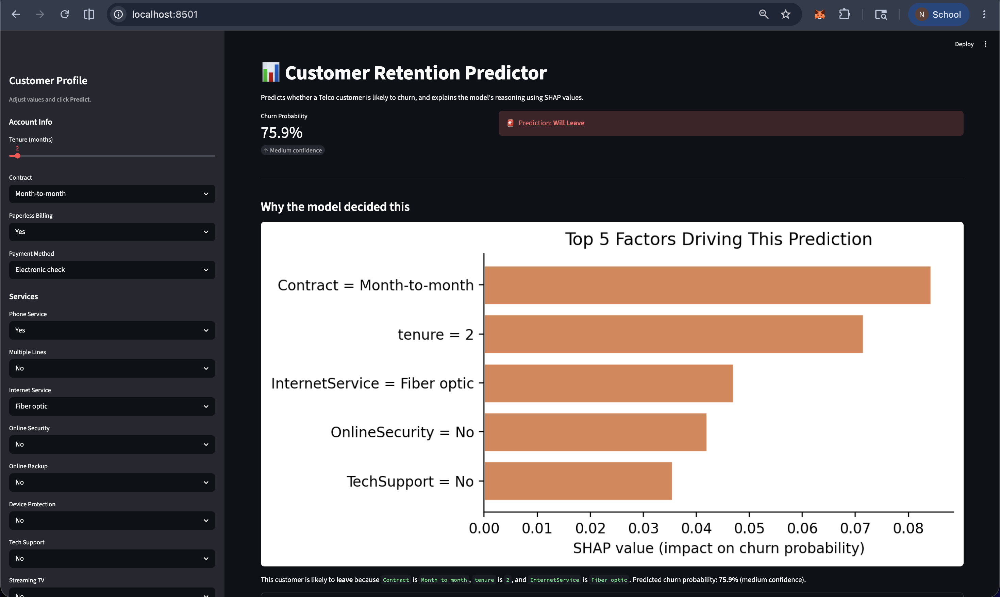
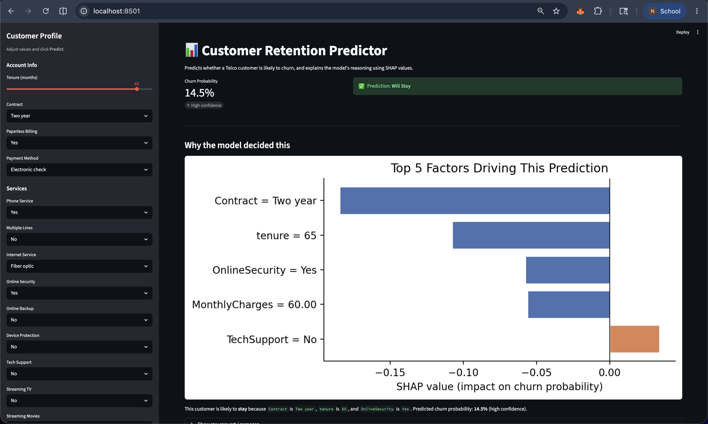
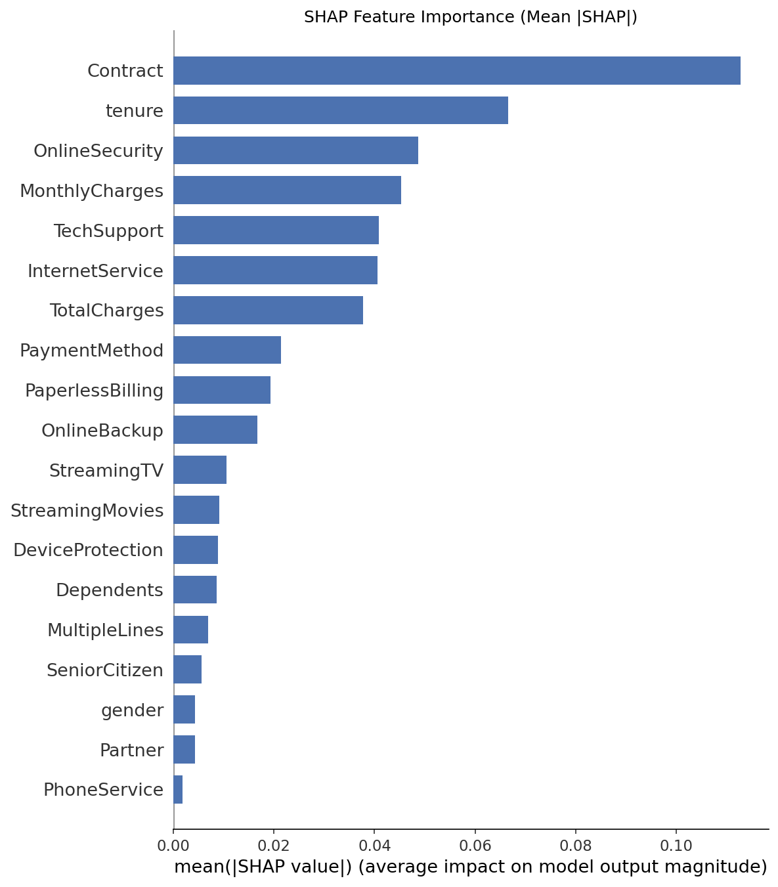

# Customer Retention Prediction using ML

> An end-to-end machine learning system that predicts whether a telecom customer will leave, explains why, and serves predictions via a REST API and interactive dashboard.


---

## Screenshots

| High-risk prediction | Low-risk prediction |
|---|---|
|  |  |
| *High-risk customer: 75.9% churn probability — Will Leave* | *Low-risk customer: 14.5% churn probability — Will Stay* |

| SHAP global importance |
|---|
|  |

*SHAP feature importance — Contract type and tenure are the strongest churn drivers*

---

## Project Overview

Telecom companies lose substantial revenue to churn — customers who cancel their subscriptions — and acquiring a new customer costs five to seven times more than retaining an existing one. This project builds a production-grade ML system that ingests customer account and usage data, predicts the probability that a customer will leave, and explains exactly which factors drove that prediction so retention teams can act on it.

The dataset is the IBM Telco Customer Churn dataset: **7,043 customers**, **19 features** covering demographics, account tenure, subscribed services, and billing, with a **26.54% churn rate**. The dominant modelling challenge is class imbalance — roughly 3 retained customers for every 1 who churns — addressed using `class_weight='balanced'` for sklearn models and `scale_pos_weight` (≈ 2.77) for XGBoost, ensuring the model is penalised appropriately for missing churners rather than simply predicting the majority class.

---

## Architecture

```
┌─────────────────────────────────────────────────────────────────┐
│                         Data Pipeline                           │
│                                                                 │
│   Telco CSV  ──►  src/data_processing.py                        │
│                   • TotalCharges coercion + median imputation   │
│                   • Drop customerID, encode Churn → 0/1         │
│                   • LabelEncode 15 categorical columns          │
│                         │                                       │
│                         ▼                                       │
│              data/processed/X.csv  ·  y.csv                    │
└─────────────────────────┬───────────────────────────────────────┘
                          │
                          ▼
┌─────────────────────────────────────────────────────────────────┐
│                        Model Training                           │
│                                                                 │
│   src/train.py  ──logs params / metrics / artifacts──►  mlruns/ │
│                                                                 │
│   Logistic Regression  │  Random Forest  │  XGBoost             │
│                                                                 │
│   ► Best model selected by validation AUC-ROC                   │
│         │                                                       │
│         ├──►  models/best_model.joblib                          │
│         └──►  models/shap_explainer.joblib                      │
└─────────────────────────┬───────────────────────────────────────┘
                          │
          ┌───────────────┴────────────────────┐
          ▼                                    ▼
┌─────────────────────┐          ┌─────────────────────────────┐
│   src/evaluate.py   │          │   api/main.py  (:8000)      │
│   • Test-set metrics│          │   POST /predict             │
│   • Confusion matrix│          │   • Pydantic validation     │
│   • ROC / PR curves │          │   • Encode → predict_proba  │
│   • SHAP plots      │          │   • SHAP top-5 factors      │
└─────────────────────┘          └──────────────┬──────────────┘
                                                │
                                                ▼
                                 ┌─────────────────────────────┐
                                 │  dashboard/app.py  (:8501)  │
                                 │  • Sidebar inputs           │
                                 │  • Probability gauge        │
                                 │  • SHAP bar chart           │
                                 │  • Plain-English summary    │
                                 └─────────────────────────────┘
```

---

## Model Results

All metrics are reported on the held-out **test set (15%, 1,057 customers)** that no model saw during training or validation.

| Model | Accuracy | Precision | Recall | F1 | AUC-ROC |
|---|---|---|---|---|---|
| Logistic Regression | 0.740 | 0.506 | 0.807 | 0.622 | 0.849 |
| **Random Forest** | **0.780** | **0.565** | 0.732 | **0.638** | **0.848** |
| XGBoost | 0.767 | 0.544 | **0.754** | 0.632 | 0.843 |

**Random Forest selected as best model based on highest AUC-ROC (0.848)** — the metric that best reflects the business goal of ranking at-risk customers for prioritised outreach regardless of threshold.

### Top 5 Churn Drivers (SHAP, mean |value|)

1. **Contract** (0.113) — Month-to-month customers face zero switching cost and churn at a dramatically higher rate. Two-year contracts create commitment that is the strongest single retention lever available.
2. **Tenure** (0.067) — The first twelve months are the highest-risk window. Each subsequent month a customer stays reduces their churn probability; loyalty compounds over time.
3. **Online Security** (0.049) — Customers without a security add-on are less embedded in the service ecosystem. The add-on creates both practical value and psychological lock-in that suppresses churn.
4. **Monthly Charges** (0.045) — Higher bills amplify perceived value risk. Customers paying premium rates without feeling they receive premium value are disproportionately likely to leave.
5. **Tech Support** (0.041) — Customers without tech support feel abandoned when issues arise. Access to support resolves friction before it becomes a cancellation trigger.

---

## Tech Stack

| Layer | Technology | Purpose |
|---|---|---|
| Data Processing | pandas, numpy | Ingestion, cleaning, label encoding, train/val/test split |
| ML Training | scikit-learn, XGBoost | Logistic Regression, Random Forest, XGBoost classifiers |
| Experiment Tracking | MLflow | Parameter/metric/artifact logging; run comparison UI |
| Explainability | SHAP | Global feature importance + per-prediction waterfall explanations |
| API | FastAPI, Uvicorn, Pydantic | REST prediction endpoint with full input validation |
| Dashboard | Streamlit, Matplotlib | Interactive prediction UI with probability gauge and SHAP chart |
| Containerisation | Docker, Docker Compose | Reproducible multi-service deployment |
| Serialisation | joblib | Model and SHAP explainer persistence |

---

## Project Structure

```
customer-retention-ml/
│
├── data/
│   ├── telco_churn.csv           # Raw dataset (downloaded by data_processing.py)
│   ├── processed/
│   │   ├── X.csv                 # Encoded feature matrix (7,043 × 19)
│   │   └── y.csv                 # Binary churn target (0 = stay, 1 = leave)
│   └── eda_plots/                # PNG outputs from the EDA notebook and evaluate.py
│
├── docs/
│   └── screenshots/              # Dashboard and SHAP plot screenshots for README
│
├── models/
│   ├── best_model.joblib         # Serialised winning model (Random Forest)
│   └── shap_explainer.joblib     # Pre-built TreeExplainer for fast inference
│
├── notebooks/
│   └── 01_eda.ipynb              # Exploratory data analysis with 5 saved plots
│
├── src/
│   ├── __init__.py
│   ├── data_processing.py        # Download, clean, encode, and save processed data
│   ├── train.py                  # Train 3 models, log to MLflow, save best + explainer
│   ├── evaluate.py               # Test-set metrics, confusion matrix, SHAP analysis
│   └── predict.py                # Batch and single-record inference utilities
│
├── api/
│   ├── __init__.py
│   └── main.py                   # FastAPI app: /health + /predict endpoints
│
├── dashboard/
│   └── app.py                    # Streamlit dashboard: inputs, gauge, SHAP chart
│
├── Dockerfile                    # python:3.11.9-slim-bookworm image for both services
├── docker-compose.yml            # Orchestrates api (:8000) + dashboard (:8501)
├── .dockerignore
├── requirements.txt
├── .gitignore
└── README.md
```

---

## How to Run

> **Prerequisite for all methods:** run `python -m src.train` at least once to generate `models/best_model.joblib` and `models/shap_explainer.joblib` before starting the API or dashboard.

---

### Quick Start (4 commands)

```bash
pip install -r requirements.txt
python -m src.train
uvicorn api.main:app --port 8000 --reload &
streamlit run dashboard/app.py
```

---

### Method 1 — Local (venv)

Best for active development and debugging.

```bash
# 1. Create and activate a virtual environment
python -m venv .venv
source .venv/bin/activate           # Windows: .venv\Scripts\activate
pip install -r requirements.txt

# 2. Download the dataset and build processed feature files
python -m src.data_processing

# 3. Train all three models and save the best one + SHAP explainer
python -m src.train

# 4. (Optional) Generate test-set metrics and SHAP plots
python -m src.evaluate

# 5. Terminal 1 — start the prediction API
uvicorn api.main:app --reload --port 8000

# 6. Terminal 2 — start the dashboard (API must be running on :8000 first)
streamlit run dashboard/app.py
```

- API: `http://localhost:8000` &nbsp;·&nbsp; Docs: `http://localhost:8000/docs`
- Dashboard: `http://localhost:8501`
- MLflow UI: `mlflow ui` → `http://localhost:5000`

Override the API host the dashboard calls with `RETENTION_API_URL`:

```bash
RETENTION_API_URL=http://localhost:9000 streamlit run dashboard/app.py
```

---

### Method 2 — Docker Compose (recommended)

Brings up both services in one command. The dashboard waits for the API's health check to pass before starting.

```bash
# Build the image and start both services
docker compose up --build

# Run detached
docker compose up --build -d

# Tear down
docker compose down
```

- API: `http://localhost:8000` &nbsp;·&nbsp; Dashboard: `http://localhost:8501`

The `models/` directory is mounted read-only into the container. Re-running `python -m src.train` on the host surfaces the updated model on the next container restart — no rebuild required.

---

### Method 3 — Individual Docker services

Useful when deploying services to separate hosts.

```bash
# Build the image once
docker build -t customer-retention-ml:1.0 .

# API (Terminal 1)
docker run --rm -p 8000:8000 \
    -v "$(pwd)/models:/app/models:ro" \
    --name retention-api \
    customer-retention-ml:1.0

# Dashboard (Terminal 2 — after API is reachable)
docker run --rm -p 8501:8501 \
    -e RETENTION_API_URL=http://host.docker.internal:8000 \
    --name retention-dashboard \
    customer-retention-ml:1.0 \
    streamlit run dashboard/app.py \
        --server.port=8501 \
        --server.address=0.0.0.0 \
        --server.headless=true \
        --browser.gatherUsageStats=false
```

On Linux replace `host.docker.internal` with `--network host` (and drop `-p`), or substitute the host bridge IP.

---

## API Reference

### `GET /health`

Liveness probe — returns API status and loaded model information.

```bash
curl http://localhost:8000/health
```

```json
{
    "status": "ok",
    "model": "RandomForestClassifier",
    "explainer": true,
    "features": 19
}
```

---

### `POST /predict`

Accepts a full customer profile and returns a churn probability, human-readable verdict, confidence band, and the top 5 SHAP factors driving the decision.

**Request — high-risk profile:**

```bash
curl -s -X POST http://localhost:8000/predict \
  -H "Content-Type: application/json" \
  -d '{
    "gender": "Female",
    "SeniorCitizen": 0,
    "Partner": "No",
    "Dependents": "No",
    "tenure": 2,
    "PhoneService": "Yes",
    "MultipleLines": "No",
    "InternetService": "Fiber optic",
    "OnlineSecurity": "No",
    "OnlineBackup": "No",
    "DeviceProtection": "No",
    "TechSupport": "No",
    "StreamingTV": "Yes",
    "StreamingMovies": "Yes",
    "Contract": "Month-to-month",
    "PaperlessBilling": "Yes",
    "PaymentMethod": "Electronic check",
    "MonthlyCharges": 95.5,
    "TotalCharges": 191.0
  }'
```

**Response:**

```json
{
    "churn_probability": 0.9008,
    "prediction": "Will Leave",
    "confidence": "High",
    "top_factors": [
        {
            "feature": "tenure",
            "value": "2",
            "impact": "increases risk",
            "shap_value": 0.0815
        },
        {
            "feature": "Contract",
            "value": "Month-to-month",
            "impact": "increases risk",
            "shap_value": 0.0793
        },
        {
            "feature": "InternetService",
            "value": "Fiber optic",
            "impact": "increases risk",
            "shap_value": 0.0479
        },
        {
            "feature": "OnlineSecurity",
            "value": "No",
            "impact": "increases risk",
            "shap_value": 0.0394
        },
        {
            "feature": "MonthlyCharges",
            "value": "95.50",
            "impact": "increases risk",
            "shap_value": 0.0369
        }
    ]
}
```

**Confidence bands:**

| Probability | Confidence |
|---|---|
| ≤ 0.20 or ≥ 0.80 | High |
| 0.20 – 0.35 or 0.65 – 0.80 | Medium |
| 0.35 – 0.65 | Low (near decision boundary) |

**Validation:** all 15 categorical fields use `Literal` types in Pydantic — submitting an unknown value returns HTTP 422 with a field-level error message.

---

## Key Learnings

- **Random Forest outperformed XGBoost on this dataset.** XGBoost's sequential boosting gains are most pronounced on larger datasets with an extended hyperparameter search budget. On roughly 5,000 training rows with default parameters, Random Forest's bagging approach — averaging 200 independently grown trees — was more robust to the mix of ordinal label-encoded categoricals and continuous billing features. XGBoost would likely close the gap with a proper search over `max_depth`, `learning_rate`, and `min_child_weight` using Optuna or Bayesian optimisation.

- **AUC-ROC was chosen over accuracy as the primary model selection metric.** With a 73/27 class split, a classifier that always predicts "no churn" achieves 73% accuracy without learning anything. AUC-ROC evaluates the model's ability to rank churners above non-churners across every possible threshold, which directly maps to the business objective of prioritising the highest-risk customers for outreach — regardless of where the decision boundary is eventually set.

- **SHAP TreeExplainer requires the raw tree estimator, not a sklearn Pipeline wrapper.** The Logistic Regression model is wrapped in a `StandardScaler → LogisticRegression` Pipeline because label-encoded features span different numeric ranges that prevent convergence otherwise. When building the TreeExplainer for whichever model wins, the Pipeline is unwrapped by extracting the final named step and applying all preceding transformers manually before passing input to the explainer. This pattern makes the explainer logic correct and reusable regardless of which model type is selected.

- **MLflow decouples experiment history from source code.** Embedding metric comparisons directly in training scripts creates silent drift as the codebase evolves. By logging parameters, metrics, and serialised artifacts to MLflow on every training run, all three model families — and any future retrains after hyperparameter tuning or feature additions — are comparable in a single UI without touching source files. The `mlruns/` directory becomes the auditable record of every experiment.

- **`scale_pos_weight` and `class_weight='balanced'` solve the same problem through different mechanisms.** Sklearn's `class_weight='balanced'` reweights individual training samples in the loss so minority-class errors are penalised more heavily. XGBoost's `scale_pos_weight` multiplies the gradient contribution of positive examples by `neg / pos` (≈ 2.77 here), achieving the same effect but at the gradient level rather than the sample level. Understanding which lever each framework exposes prevents the common mistake of applying one without the other when switching between frameworks.

---

## License

MIT — see [LICENSE](LICENSE) for details.
